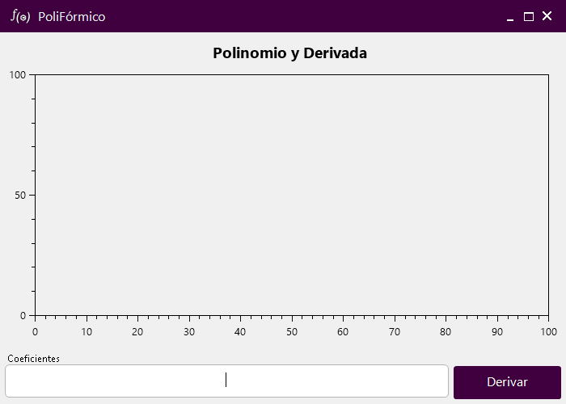
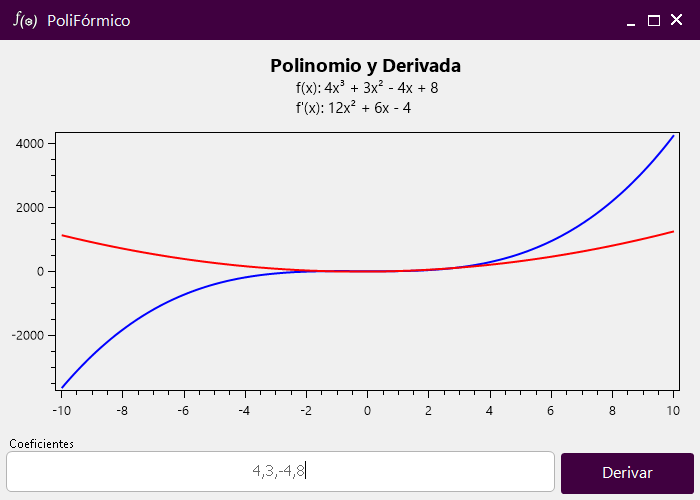

# PoliFórmico

## Información del Proyecto

Proyecto desarrollado en respuesta al requerimiento establecido para la materia de Programación Orientada a Objetos, en colaboración con Análisis Matemático II.

El propósito de este proyecto es proporcionar una herramienta que permita graficar un polinomio de grado N y su derivada en base a los coeficientes ingresados por el usuario.

Los coeficientes se ingresan en un campo de texto, separados por comas. Por ejemplo, para el polinomio \(2x^3 + 3x^2 - 4x + 5\), los coeficientes serían `2,3,-4,5`.

## Compilación y Ejecución

El proyecto está desarrollado en C# utilizando .NET 8. Se puede compilar desde [Visual Studio](https://visualstudio.microsoft.com/es/downloads/) o [utilizando la línea de comandos con el SDK de .NET.](https://learn.microsoft.com/es-es/dotnet/core/tools/dotnet-build)

## Capturas

> 
> 
> Interfaz principal del programa donde se ingresan los coeficientes del polinomio.

> 
>
> Gráfico del polinomio y su derivada, generado a partir de los coeficientes ingresados.

---

Desarrollado por [Alejo Sarmiento](https://alejoide.com).